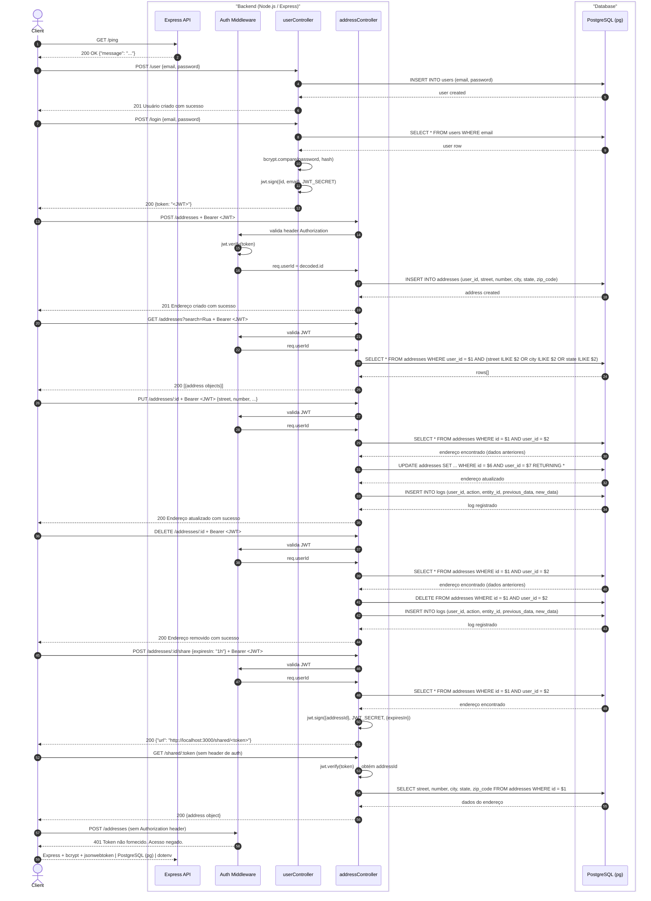

#  Backend Endereço

Serviço de backend construído em Node.js e Express para um CRUD de endereços com rotas protegidas por JWT. O sistema conta com logs passivos para operações críticas, testes automatizados e endpoints de acesso temporário não autenticado via links de compartilhamento.

##  Pré-requisitos

* [Node.js](https://nodejs.org/) (v18 ou superior)
* [Docker](https://docs.docker.com/get-docker/) & [Docker Compose](https://docs.docker.com/compose/install/)
* [PostgreSQL](https://www.postgresql.org/download/) (apenas caso rode localmente sem o Docker)

---

##  Arquitetura e Fluxo de Dados


## Rodando com Docker (recomendado)

1. Clone o repositório e acesse a pasta:

```bash
git clone https://github.com/JeffersonSantos29/backend-endereco.git
cd backend-endereco
```

2. Suba os containers:

```bash
docker-compose up --build
```

3. A API estará disponível em `http://localhost:3000`.

## Rodando localmente (sem Docker)

1. Clone o repositório e instale as dependências:

```bash
git clone https://github.com/JeffersonSantos29/backend-endereco.git
cd backend-endereco
npm install
```

2. Certifique-se de que o PostgreSQL está rodando e crie o banco:

```sql
CREATE DATABASE address_db;
```

3. Copie o arquivo `.env` (já incluído no repositório) e ajuste `DB_HOST` para `127.0.0.1` caso o banco esteja na mesma máquina.

4. Inicie a aplicação:

```bash
npm start
```

## Variáveis de ambiente

| Variável     | Descrição                        | Valor padrão       |
|--------------|----------------------------------|--------------------|
| `PORT`       | Porta da API                     | `3000`             |
| `DB_HOST`    | Host do PostgreSQL               | `127.0.0.1`        |
| `DB_PORT`    | Porta do PostgreSQL              | `5432`             |
| `DB_USER`    | Usuário do banco                 | `admin`            |
| `DB_PASSWORD`| Senha do banco                   | `admin`            |
| `DB_NAME`    | Nome do banco de dados           | `address_db`       |
| `JWT_SECRET` | Chave secreta para JWT           | `123`              |

## Comandos úteis

| Comando        | Descrição                              |
|----------------|----------------------------------------|
| `npm start`    | Inicia a API (também cria as tabelas)  |
| `npm run dev`  | Inicia com nodemon (auto-reload)       |
| `npm test`     | Executa os testes                      |

## Estrutura do projeto

```
_tests_/
postman/
src/
├── config/
├── controllers/
├── middlewares/
├── routes/
└── server.js
```

## Endpoints principais

GetAdress

Método: GET

` http://localhost:3000/addresses?search=joinville`

CreateUser

Método: POST

` http://localhost:3000/user`


Update data

Método: PUT

`http://localhost:3000/addresses/2`

Delete Dado-endereco

Método: DELETE

` http://localhost:3000/addresses/2`

Login

Método: POST

` http://localhost:3000/login`

Adress

Método: POST

` http://localhost:3000/addresses`

CreateShared(link-temporário)

Método: POST

` http://localhost:3000/addresses/3/share`


